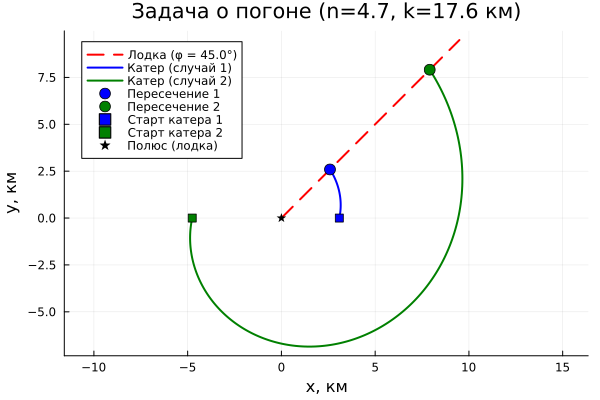

---
## Author
author:
  name: Дагделен Зейнап Реджеповна
  degrees: DSc
  orcid: 0000-0002-0877-7063
  email: 1132236052@rudn.ru
  affiliation:
    - name: Российский университет дружбы народов
      country: Российская Федерация
      postal-code: 117198
      city: Москва
      address: ул. Орджоникизде, д. 3
## Title
title: лабораторная работа 2
subtitle: задача о погоне
license: CC BY
date: today
date-format: "YYYY-MM-DD" # Example: 2025-09-06
---

# Информация

## Докладчик

:::::::::::::: {.columns align=center}
::: {.column width="70%"}

  * Дагделен Зейнап Реджеповна
  * студентка НКНбд-01-23
  * факультет физико-математических и естественных наук
  * Российский университет дружбы народов им. П. Лумумбы
  * [1132236052@rudn.ru](mailto:1132236052@pfur.ru)
  * <https://zrdagdelen.github.io>

:::
::: {.column width="30%"}

:::
::::::::::::::

# Вводная часть

## Цель

Изучить построение математической модели задачи преследования в полярных координатах, вывести дифференциальные уравнения движения катера при произвольном отношении скоростей, реализовать модель в среде Julia и определить точку пересечения траекторий численными методами.

## Условие задачи

Катер береговой охраны преследует лодку браконьеров.
В момент обнаружения расстояние между ними равно:

$$
k = 17.6 \text{ км}
$$

Скорость катера в:

$$
n = 4.7
$$

раз больше скорости лодки.

Требуется:

1. Вывести уравнение движения катера для двух случаев.
2. Построить траектории движения.
3. Найти точку пересечения траекторий.

# Процесс решения

## Нахождение расстояния после которого катер начнет
двигаться вокруг полюса (2 случая)

| Случай 1 | Случай 2 |
| -------- | -------- |
| $\frac{x}{v} = \frac{k - x}{nv}$ | $\frac{x}{v} = \frac{k + x}{nv}$ |
| $x_1 = \frac{k}{n + 1}$ | $x_2 = \frac{k}{n - 1}$ |
| $x_1 = \frac{17.6}{5.7} = 3.0877$ | $x_2 = \frac{17.6}{3.7} = 4.7568$ |

## Программная реализация 

Напишем код, который создаёт численные параметры для двух сценариев расположения катера, на основе которых строятся уравнения движения в полярных координатах. С его помощью рассчитывается дистанция перехвата лодки от полюса, после чего выполняется визуализация траекторий обеих целей и отмечаются точки их пересечения. 

## Результаты

| Параметр | Случай 1 | Случай 2 |
| :--- | :--- | :--- |
| **Старт катера (x)** | 3.09 км (ближе) | 4.76 км (дальше) |
| **Встреча (r)** | 3.66 км | 11.19 км |
| **Дистанция до встречи** | Малая | Большая |
| **Вывод** | Катер в выгодной позиции | Катер в невыгодной позиции |

## Анализ графика и результатов

{width=65%}

## Вывод

- Была построена математическая модель задачи о погоне.

- Получено аналитическое решение в виде логарифмической спирали.

- Численно определена точка пересечения траекторий.

