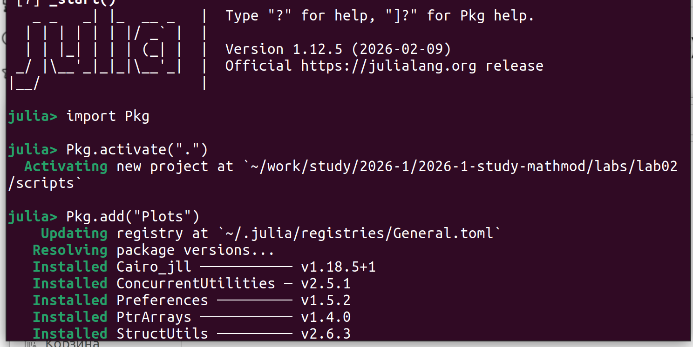
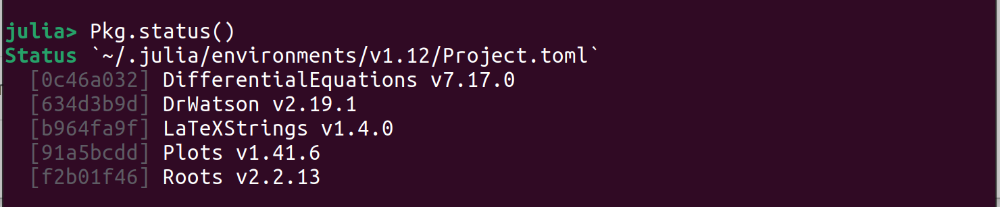
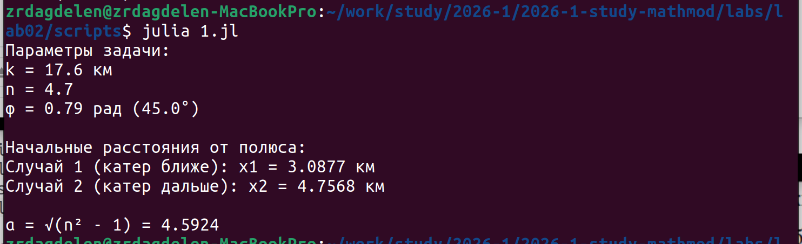
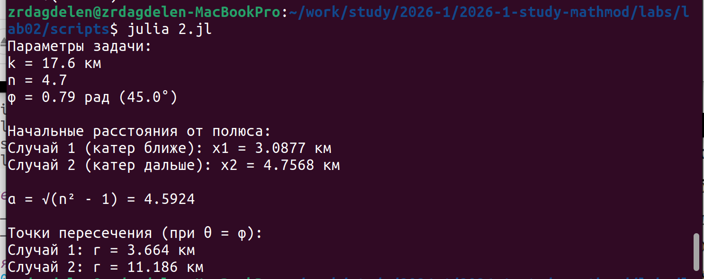
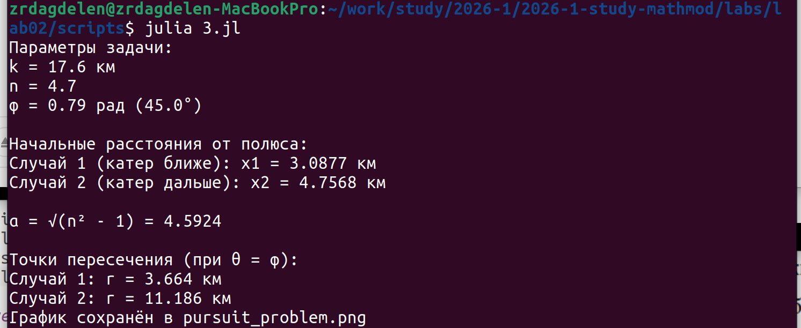
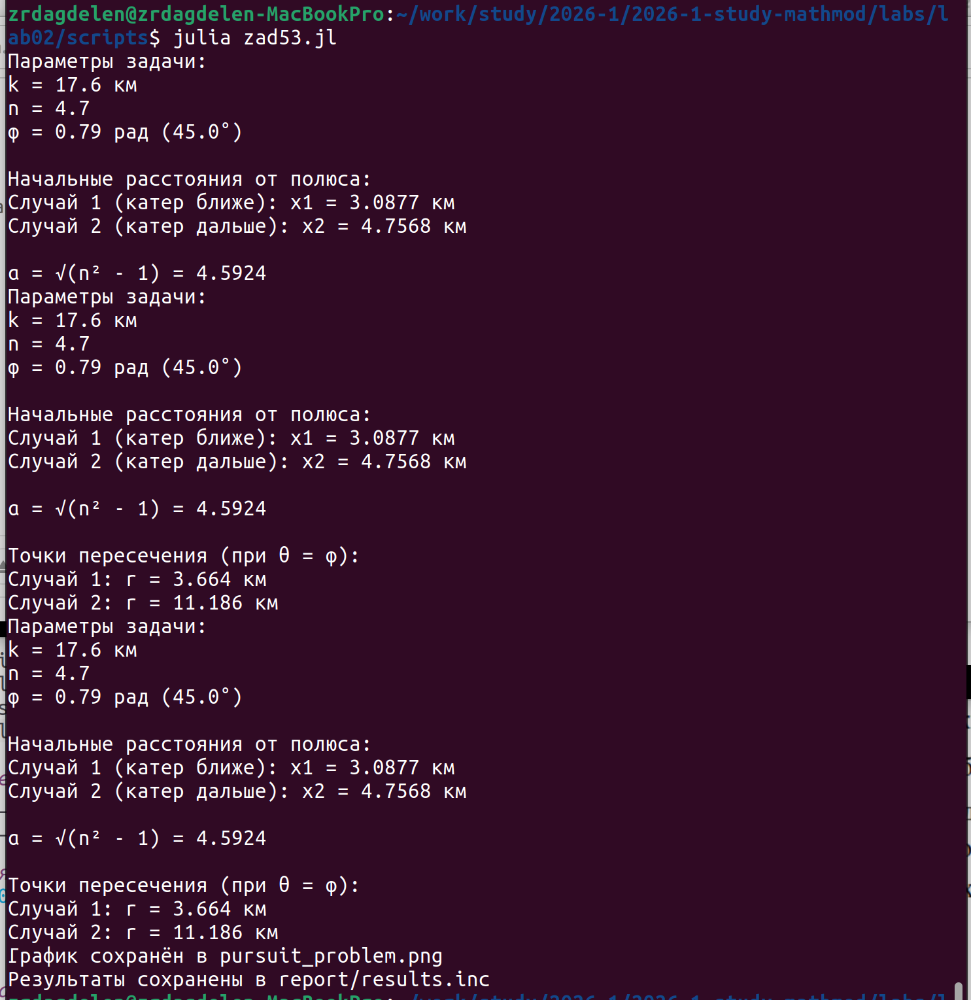

---
## Author
author:
  name: Дагделен Зейнап Реджеповна
  degrees: DSc
  orcid: 0000-0002-0877-7063
  email: 1132236052@rudn.ru
  affiliation:
    - name: Российский университет дружбы народов
      country: Российская Федерация
      postal-code: 117198
      city: Москва
      address: ул. Орджоникидзе, д. 3

## Title
title: "Лабораторная работа 2"
subtitle: "Задача о погоне"
license: "CC BY"
---

# Цель работы

Изучить построение математической модели задачи преследования в полярных координатах, вывести дифференциальные уравнения движения катера при произвольном отношении скоростей, реализовать модель в среде Julia и определить точку пересечения траекторий численными методами.

# Задание

1. Вывести дифференциальные уравнения движения катера береговой охраны при условии, что его скорость в 
n=4.7 раза больше скорости лодки.

2. Определить начальные условия для двух случаев расположения катера относительно лодки.

3. Построить траектории движения катера и лодки.

4. Найти точку пересечения траекторий численным методом.


# Выполнение лабораторной работы

## Математическое моделирование задачи о погоне

**Вариант 53**

---

## 1. Условие задачи

Катер береговой охраны преследует лодку браконьеров.
В момент обнаружения расстояние между ними равно:

$$
k = 17.6 \text{ км}
$$

Скорость катера в:

$$
n = 4.7
$$

раз больше скорости лодки.

Требуется:

1. Вывести уравнение движения катера для двух случаев.
2. Построить траектории движения.
3. Найти точку пересечения траекторий.

---

## 2. Математическая модель

Пусть:

* скорость лодки: $v$
* скорость катера: $nv$
* полюс — точка обнаружения лодки
* движение описывается в полярных координатах

---

### 2.1 Разложение скорости катера

Полная скорость катера:

$$
(nv)^2 = v_r^2 + v_\theta^2
$$

Так как радиальная скорость должна совпадать со скоростью лодки:

$$
v_r = v
$$

Получаем:

$$
(nv)^2 = v^2 + v_\theta^2
$$

$$
v_\theta = v\sqrt{n^2 - 1}
$$

Но

$$
v_\theta = r \frac{d\theta}{dt}
$$

Следовательно:

$$
\frac{dr}{dt} = v
$$

$$
\frac{d\theta}{dt} = \frac{v\sqrt{n^2 - 1}}{r}
$$

---

### 2.2 Исключение времени

$$
\frac{dr}{d\theta} = \frac{r}{\sqrt{n^2 - 1}}
$$

Разделяя переменные:

$$
\frac{dr}{r} = \frac{d\theta}{\sqrt{n^2 - 1}}
$$

Интегрируя:

$$
\ln r = \frac{\theta}{\sqrt{n^2 - 1}} + C
$$

$$
r = C e^{\theta/\sqrt{n^2 - 1}}
$$

Траектория катера — **логарифмическая спираль**.

---

## 3. Начальные условия

Дано:

$$
k = 17.6
$$

$$
n = 4.7
$$

---

### Случай 1

$$
\frac{x}{v} = \frac{k - x}{nv}
$$

$$
x_1 = \frac{k}{n + 1}
$$

$$
x_1 = \frac{17.6}{5.7} = 3.0877
$$

---

### Случай 2

$$
\frac{x}{v} = \frac{k + x}{nv}
$$

$$
x_2 = \frac{k}{n - 1}
$$

$$
x_2 = \frac{17.6}{3.7} = 4.7568
$$

---

## 4. Программная реализация (Julia)

Создадим код, который подготавливает численные значения для двух случаев расположения катера и вычисляет вспомогательный коэффициент, необходимый для составления уравнений движения, которые требуются в пункте 1 задания (этот код будет в файле 1.jl).

```julia
using Plots, LaTeXStrings

# Данные варианта 53
k = 17.6        # начальное расстояние между катером и лодкой, км
n = 4.7        # отношение скоростей V_катера / V_лодки
φ = π/4        # угол направления лодки (45°)

println("Параметры задачи:")
println("k = $k км")
println("n = $n")
println("φ = $(round(φ, digits=2)) рад ($(round(φ*180/π))°)")

# Расчёт начальных расстояний
x1 = k / (n + 1)
x2 = k / (n - 1)

println("Начальные расстояния от полюса:")
println("Случай 1 (катер ближе): x1 = $(round(x1, digits=4)) км")
println("Случай 2 (катер дальше): x2 = $(round(x2, digits=4)) км")

# Коэффициент α = √(n² - 1)
α = sqrt(n^2 - 1)
println("α = √(n² - 1) = $(round(α, digits=4))")
```

Создаем новый проект в нужной директории 2 лабораторной ($$рис. @fig-001]) и мпортируем нужные библиотеки. Проверяем ([рис. @fig-002]).

{#fig-001 width=70%}

{#fig-002 width=70%}

Смотрим на вывод кода 1.jl ([рис. @fig-003]).

{#fig-003 width=70%}


---

Теперь напишем код, который берёт начальные данные из первого файла, строит математические уравнения движения катера (в полярных координатах это спирали) и вычисляет, на каком расстоянии от полюса катер перехватит лодку для двух возможных начальных положений  (код будет в файле 2.jl)

```julia
include("1.jl")  # подгружаем параметры из первого файла

# Функции траектории катера
r1(θ) = x1 * exp(θ / α)           # случай 1, θ ∈ [0, φ]
r2(θ) = x2 * exp((θ + π) / α)      # случай 2, θ ∈ [-π, φ]

# Точки пересечения (θ = φ)
r_intersect1 = r1(φ)
r_intersect2 = r2(φ)

println("Точки пересечения (при θ = φ):")
println("Случай 1: r = $(round(r_intersect1, digits=3)) км")
println("Случай 2: r = $(round(r_intersect2, digits=3)) км")
```

Посмотрим на вывод кода 2.jl ([рис. @fig-004]).

{#fig-004 width=70%}

---

Теперь нам нужен код, который бы делал  построение траекторий движения катера и лодки для двух случаев, а также визуализирует точки пересечения (которые были найдены в предыдущем файле). Он будет в файле 3.jl.

```julia
include("2.jl")

# Случай 1
θ_range1 = range(0, φ, length=200)
r_vals1 = r1.(θ_range1)

# Случай 2
θ_range2 = range(-π, φ, length=200)
r_vals2 = r2.(θ_range2)

# Лодка
ρ_range = range(0, max(r_intersect1, r_intersect2)*1.2, length=100)
x_boat = ρ_range .* cos(φ)
y_boat = ρ_range .* sin(φ)

# Преобразование в декартовы координаты
x1_cart = r_vals1 .* cos.(θ_range1)
y1_cart = r_vals1 .* sin.(θ_range1)

x2_cart = r_vals2 .* cos.(θ_range2)
y2_cart = r_vals2 .* sin.(θ_range2)

# Точки пересечения
x_intersect1 = r_intersect1 * cos(φ)
y_intersect1 = r_intersect1 * sin(φ)

x_intersect2 = r_intersect2 * cos(φ)
y_intersect2 = r_intersect2 * sin(φ)

# График
p = plot(aspect_ratio=:equal, legend=:topleft, 
         title="Задача о погоне (n=$n, k=$k км)")

plot!(p, x_boat, y_boat, label="Лодка (φ = $(round(φ*180/π))°)", 
      linewidth=2, color=:red, linestyle=:dash)

plot!(p, x1_cart, y1_cart, label="Катер (случай 1)", 
      linewidth=2, color=:blue)

plot!(p, x2_cart, y2_cart, label="Катер (случай 2)", 
      linewidth=2, color=:green)

scatter!(p, [x_intersect1], [y_intersect1], label="Пересечение 1", 
         color=:blue, markersize=6)
scatter!(p, [x_intersect2], [y_intersect2], label="Пересечение 2", 
         color=:green, markersize=6)

scatter!(p, [x1], [0], label="Старт катера 1", 
         color=:blue, markersize=4, marker=:square)
scatter!(p, [-x2], [0], label="Старт катера 2", 
         color=:green, markersize=4, marker=:square)

scatter!(p, [0], [0], label="Полюс (лодка)", 
         color=:black, markersize=5, marker=:star5)

xlabel!("x, км")
ylabel!("y, км")

display(p)
savefig(p, "pursuit_problem.png")
println("График сохранён в pursuit_problem.png")
```

Посмотрим на вывод кода 3.jl ([рис. @fig-005]).

{#fig-005 width=70%}

---

Чтобы весь итог был в одном месте, напишем код, который собирает все результаты расчётов(код будет в файле zad53.jl)

```julia
include("1.jl")
include("2.jl")
include("3.jl")

# Сохраняем числа в текстовый файл
open("../report/results.inc", "w") do f
    println(f, "\\newcommand{\\xone}{", round(x1, digits=4), "}")
    println(f, "\\newcommand{\\xtwo}{", round(x2, digits=4), "}")
    println(f, "\\newcommand{\\alphaVal}{", round(α, digits=4), "}")
    println(f, "\\newcommand{\\rintersectone}{", round(r_intersect1, digits=3), "}")
    println(f, "\\newcommand{\\rintersecttwo}{", round(r_intersect2, digits=3), "}")
    println(f, "\\newcommand{\\xintone}{", round(x_intersect1, digits=3), "}")
    println(f, "\\newcommand{\\yintone}{", round(y_intersect1, digits=3), "}")
    println(f, "\\newcommand{\\xinttwo}{", round(x_intersect2, digits=3), "}")
    println(f, "\\newcommand{\\yinttwo}{", round(y_intersect2, digits=3), "}")
end

println("Результаты сохранены в report/results.inc")
```

Посмотрим на результаты всех наших расчетов ([рис. @fig-005]).

{#fig-005 width=70%}

* Траектория катера представляет собой логарифмическую спираль.
* В обоих случаях катер пересекает траекторию лодки.
* Точка пересечения определяется численно методом поиска корня.
* Увеличение параметра n уменьшает время перехвата.

Посмотрим и проанализируем график ([рис. @fig-006]).

{#fig-006 width=70%}

1. Сравнение случаев

| Параметр | Случай 1 (Синий) | Случай 2 (Зеленый) |
| :--- | :--- | :--- |
| **Старт катера (x)** | 3.09 км (ближе) | 4.76 км (дальше) |
| **Встреча (r)** | 3.66 км | 11.19 км |
| **Дистанция до встречи** | Малая | Большая |
| **Вывод** | Катер в выгодной позиции | Катер в невыгодной позиции |

2.  **Геометрия погони:**
    *   В **Случае 1** катер находится внутри траектории лодки и перехватывает её по пологой спирали почти сразу.
    *   В **Случае 2** катер находится снаружи. Из-за геометрии и постоянного курса лодки, катеру приходится совершить длинный обходной манёвр (спираль), чтобы выйти в точку пересечения. Несмотря на огромное преимущество в скорости (в 4.7 раза!), лодка уходит очень далеко (более 11 км), что показывает важность *начальной позиции*, а не только скорости.
3.  **График:** Должен наглядно показывать, как синяя спираль (случай 1) быстро втыкается в красную линию (лодка), а зеленая спираль (случай 2) делает большой "крюк", прежде чем достичь красной линии далеко от центра.

---

# Вывод

В ходе лабораторной работы была построена математическая модель задачи о погоне.

Получено аналитическое решение в виде логарифмической спирали.

Численно определена точка пересечения траекторий.

Модель подтверждает, что при скорости катера, превышающей скорость лодки в 4.7 раза, перехват возможен.


# Список литературы{.unnumbered}

[Варианты задач (мой 53)](https://esystem.rudn.ru/pluginfile.php/3094568/mod_resource/content/2/%D0%97%D0%B0%D0%B4%D0%B0%D0%BD%D0%B8%D0%B5%20%D0%BA%20%D0%BB%D0%B0%D0%B1%D0%BE%D1%80%D0%B0%D1%82%D0%BE%D1%80%D0%BD%D0%BE%D0%B9%20%D1%80%D0%B0%D0%B1%D0%BE%D1%82%D0%B5%20%E2%84%96%205%20%281%29.pdf)

[Пример решения лабораторной работы 2](https://esystem.rudn.ru/pluginfile.php/3094567/mod_resource/content/2/%D0%9B%D0%B0%D0%B1%D0%BE%D1%80%D0%B0%D1%82%D0%BE%D1%80%D0%BD%D0%B0%D1%8F%20%D1%80%D0%B0%D0%B1%D0%BE%D1%82%D0%B0%20%E2%84%96%201.pdf)

::: {#refs}
:::
