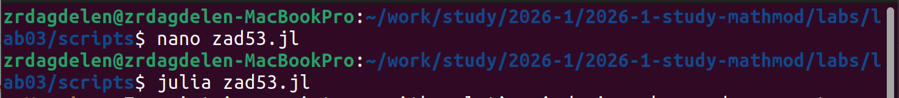
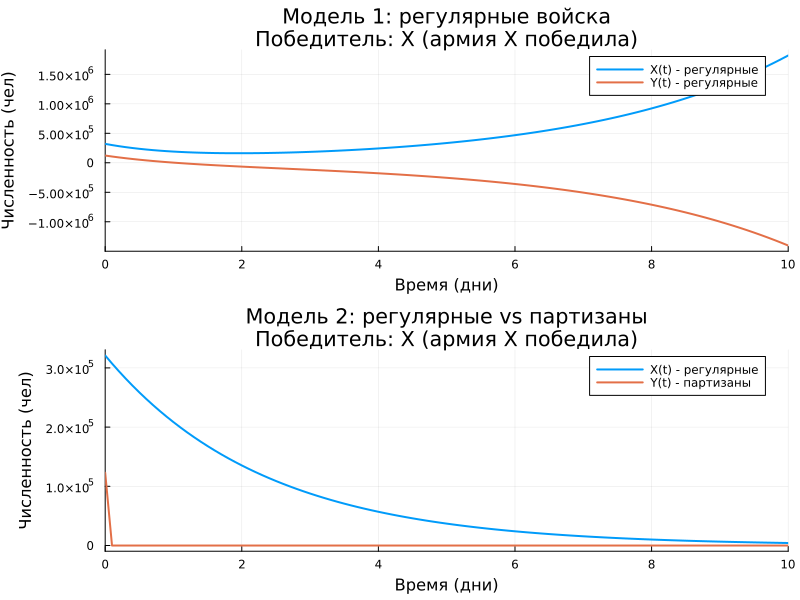

---
## Author
author:
  name: Дагделен Зейнап Реджеповна
  degrees: DSc
  orcid: 0000-0002-0877-7063
  email: 1132236052@rudn.ru
  affiliation:
    - name: Российский университет дружбы народов
      country: Российская Федерация
      postal-code: 117198
      city: Москва
      address: ул. Орджоникизде, д. 3
## Title
title: лабораторная работа 3
subtitle: Модели боевых действий Ланчестера
license: CC BY
date: today
date-format: "YYYY-MM-DD" # Example: 2025-09-06
---

# Информация

## Докладчик

:::::::::::::: {.columns align=center}
::: {.column width="70%"}

  * Дагделен Зейнап Реджеповна
  * студентка НКНбд-01-23
  * факультет физико-математических и естественных наук
  * Российский университет дружбы народов им. П. Лумумбы
  * [1132236052@rudn.ru](mailto:1132236052@pfur.ru)
  * <https://zrdagdelen.github.io>

:::
::: {.column width="30%"}

:::
::::::::::::::

# Вводная часть

## Цель

Исследовать динамику изменения численности противостоящих армий с помощью моделей Ланчестера. Построить графики изменения численности для двух случаев:
- боевые действия между регулярными войсками;
- боевые действия регулярной армии против партизанских отрядов.

Определить победителя в каждом случае и проанализировать условия победы.

## Условие задачи

Между страной $X$ и страной $Y$ идёт война. В начальный момент времени:

- $x(0) = 321\,000$ человек (армия страны $X$),
- $y(0) = 123\,000$ человек (армия страны $Y$).

Коэффициенты потерь и эффективности постоянны, функции подкрепления $P(t)$ и $Q(t)$ непрерывны.

# Процесс решения

## Создание файла и кода

{width=65%}

## Таблица конечных результатов

| Модель | Тип боевых действий | Начальная X (чел) | Начальная Y (чел) | Конечная X (чел) | Конечная Y (чел) | Победитель |
|--------|---------------------|-------------------|-------------------|------------------|------------------|------------|
| 1 | Регулярные vs Регулярные | 321 000 | 123 000 |  1 820 119 | -1 403 062 | **Армия X** |
| 2 | Регулярные vs Партизаны | 321 000 | 123 000 | 4 272 | 0 | **Армия X** |

## Анализ графика и результатов

{width=65%}

## Вывод

- Реализованы две модели Ланчестера на языке Julia.
- Построены графики изменения численности армий и нашли победителей в каждом сценарии.
- Проведён сравнительный анализ моделей.

