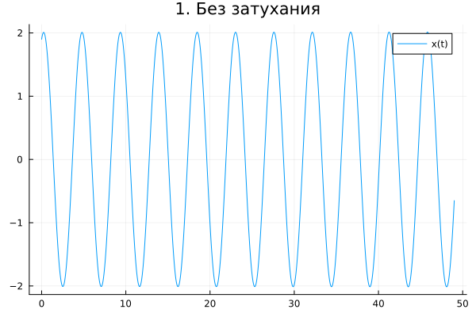
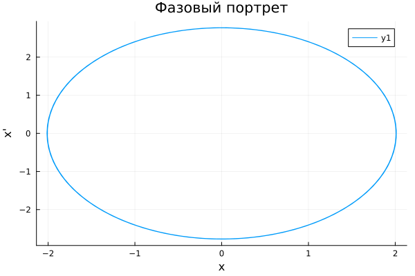
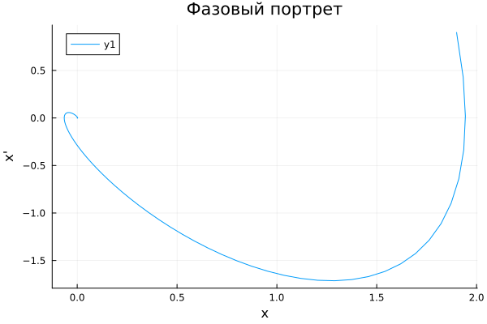
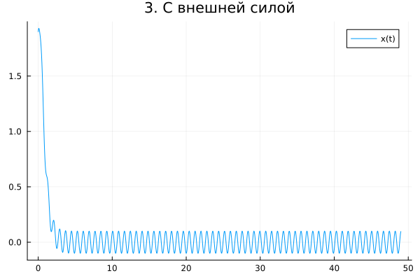
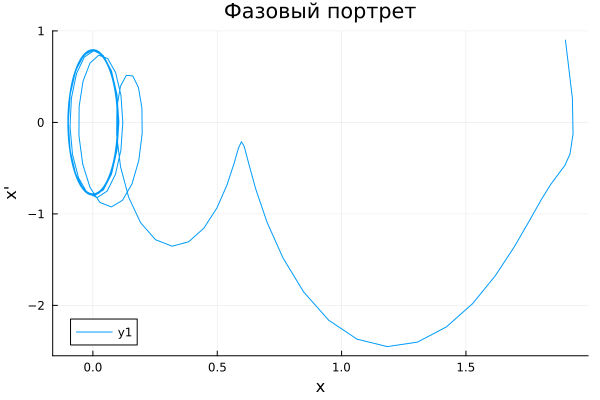

---
## Author
author:
  name: Дагделен Зейнап Реджеповна
  degrees: DSc
  orcid: 0000-0002-0877-7063
  email: 1132236052@rudn.ru
  affiliation:
    - name: Российский университет дружбы народов
      country: Российская Федерация
      postal-code: 117198
      city: Москва
      address: ул. Орджоникизде, д. 3
## Title
title: лабораторная работа 4
subtitle: Модель гармонических колебаний
license: CC BY
date: today
date-format: "YYYY-MM-DD" # Example: 2025-09-06
---

# Информация

## Докладчик

:::::::::::::: {.columns align=center}
::: {.column width="70%"}

  * Дагделен Зейнап Реджеповна
  * студентка НКНбд-01-23
  * факультет физико-математических и естественных наук
  * Российский университет дружбы народов им. П. Лумумбы
  * [1132236052@rudn.ru](mailto:1132236052@pfur.ru)
  * <https://zrdagdelen.github.io>

:::
::: {.column width="30%"}

:::
::::::::::::::

# Вводная часть

## Цель работы

Изучить поведение гармонического осциллятора в различных условиях (без затухания, с затуханием, под действием внешней силы), построить решения дифференциальных уравнений и соответствующие фазовые портреты.

## Задание

Построить решение уравнения гармонического осциллятора и его фазовый портрет для следующих случаев:

1. Без затухания и без внешней силы
2. С затуханием и без внешней силы
3. С затуханием и под действием внешней силы

с начальными условиями

# Выполнение лабораторной работы

## Что такое гармонический осциллятор?

Гармонический осциллятор описывает самые разные системы:

- грузик на пружине;

- математический маятник;

- колебательный контур в электричестве;

- поведение систем в химии, биологии и даже экономике.

Несмотря на разную природу, эти системы подчиняются одному и тому же дифференциальному уравнению.

## Без затухания и без внешней силы. Решение уравнения

{#fig-001 width=70%}

## Без затухания и без внешней силы. Фазовый портрет

{#fig-002 width=70%}

## С затуханием и без внешней силы. Решение уравнения

{#fig-003 width=70%}

## С затуханием и без внешней силы. Фазовый портрет

{#fig-004 width=70%}

## С затуханием и под действием внешней силы. Решение уравнения

{#fig-005 width=70%}

## С затуханием и под действием внешней силы. Фазовый портрет

{#fig-006 width=70%}

## Вывод

В ходе работы были исследованы три режима работы гармонического осциллятора.
