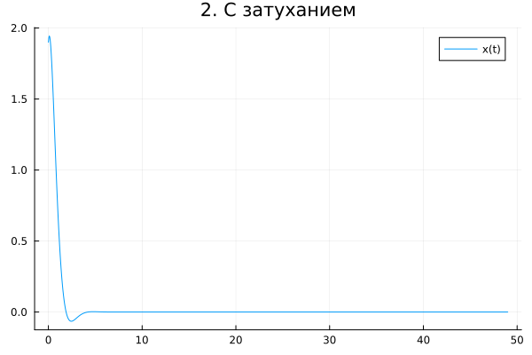

---
## Author
author:
  name: Дагделен Зейнап Реджеповна
  degrees: DSc
  orcid: 0000-0002-0877-7063
  email: 1132236052@rudn.ru
  affiliation:
    - name: Российский университет дружбы народов
      country: Российская Федерация
      postal-code: 117198
      city: Москва
      address: ул. Орджоникидзе, д. 3


## Title
title: "Лабораторная работа №4"
subtitle: "Модель гармонических колебаний"
license: "CC BY"
---

# Цель работы

Изучить поведение гармонического осциллятора в различных условиях (без затухания, с затуханием, под действием внешней силы), построить решения дифференциальных уравнений и соответствующие фазовые портреты.

# Задание

Построить решение уравнения гармонического осциллятора и его фазовый портрет для следующих случаев:

1. Без затухания и без внешней силы:
   $\ddot{x} + 1.9x = 0$

2. С затуханием и без внешней силы:
   $\ddot{x} + 2.9\dot{x} + 3.9x = 0$

3. С затуханием и под действием внешней силы:
   $\ddot{x} + 4.9\dot{x} + 5.9x = 6.9\sin(7.9t)$
   
Начальные условия:
$x(0) = 1.9$, $\dot{x}(0) = 0.9$

Интервал:

$t \in [0, 49]$, шаг $0.05$

# Теоретическое введение

Гармонический осциллятор описывается дифференциальным уравнением второго порядка:

$$
\ddot{x} + \gamma \dot{x} + \omega^2 x = f(t)
$$

где:

* $x$ — смещение,
* $\gamma$ — коэффициент затухания,
* $\omega$ — собственная частота,
* $f(t)$ — внешняя сила.

Для численного решения уравнение второго порядка приводится к системе двух уравнений первого порядка:

$$
\begin{cases}
x' = y \\
y' = -\omega^2 x - \gamma y + f(t)
\end{cases}
$$

Фазовое пространство задаётся координатами $(x, y)$, где $y = \dot{x}$.
Фазовая траектория — это кривая, описывающая состояние системы во времени.
Совокупность таких траекторий называется фазовым портретом.

# Выполнение лабораторной работы

Для решения дифференциальных уравнений использовался язык Julia и пакет `DifferentialEquations.jl`.

Были получены:

* графики зависимости $x(t)$
* фазовые портреты $(x, \dot{x})$

для всех трёх случаев.

Далее представлен код:

```julia
using DifferentialEquations
using Plots

# начальные условия
u0 = [1.9, 0.9]   # [x, x']
tspan = (0.0, 49.0)
t = 0:0.05:49

##################################################
# 1. Без затухания
# x'' + 1.9x = 0
##################################################

function osc1!(du, u, p, t)
    du[1] = u[2]
    du[2] = -1.9 * u[1]
end

prob1 = ODEProblem(osc1!, u0, tspan)
sol1 = solve(prob1, saveat=t)

p1 = plot(sol1.t, sol1[1,:], title="1. Без затухания", label="x(t)")
p2 = plot(sol1[1,:], sol1[2,:], xlabel="x", ylabel="x'", 
				title="Фазовый портрет")

##################################################
# 2. С затуханием
# x'' + 2.9x' + 3.9x = 0
##################################################

function osc2!(du, u, p, t)
    du[1] = u[2]
    du[2] = -3.9 * u[1] - 2.9 * u[2]
end

prob2 = ODEProblem(osc2!, u0, tspan)
sol2 = solve(prob2, saveat=t)

p3 = plot(sol2.t, sol2[1,:], title="2. С затуханием", label="x(t)")
p4 = plot(sol2[1,:], sol2[2,:], xlabel="x", ylabel="x'", 
				title="Фазовый портрет")

##################################################
# 3. С затуханием и внешней силой
# x'' + 4.9x' + 5.9x = 6.9 sin(7.9t)
##################################################

function osc3!(du, u, p, t)
    du[1] = u[2]
    du[2] = -5.9 * u[1] - 4.9 * u[2] + 6.9*sin(7.9*t)
end

prob3 = ODEProblem(osc3!, u0, tspan)
sol3 = solve(prob3, saveat=t)

p5 = plot(sol3.t, sol3[1,:], title="3. С внешней силой", label="x(t)")
p6 = plot(sol3[1,:], sol3[2,:], xlabel="x", ylabel="x'", 
						title="Фазовый портрет")

##################################################
# вывод 
##################################################
savefig(p1, "osc1_time.png")
savefig(p2, "osc1_phase.png")
savefig(p3, "osc2_time.png")
savefig(p4, "osc2_phase.png")
savefig(p5, "osc3_time.png")
savefig(p6, "osc3_phase.png")

p_all = plot(p1, p2, p3, p4, p5, p6, layout=(3,2))
savefig(p_all, "all_plots.png")
```

## Осциллятор без затухания

**Анализ результатов:** 

График $x(t)$ представляет собой периодические колебания с постоянной амплитудой. Это связано с отсутствием потерь энергии в системе ([рис. @fig-001]).

{#fig-001 width=70%}


Фазовый портрет представляет собой замкнутую кривую (эллипс), что указывает на сохранение полной энергии системы. Траектория не стремится ни к нулю, ни к бесконечности ([рис. @fig-002]).

{#fig-002 width=70%}


## Осциллятор с затуханием

**Анализ результатов:**

График $x(t)$ показывает затухающие колебания: амплитуда со временем уменьшается и стремится к нулю ([рис. @fig-003]).

{#fig-003 width=70%}

Фазовый портрет имеет вид спирали, закручивающейся к началу координат. Это означает, что система теряет энергию и со временем приходит в состояние покоя ([рис. @fig-004]).

{#fig-004 width=70%}


## Осциллятор с затуханием и внешней силой

**Анализ результатов:**

График $x(t)$ демонстрирует сложное поведение: после переходного процесса система выходит на установившиеся колебания([рис. @fig-005]).

{#fig-005 width=70%}

Фазовый портрет сначала показывает затухающую динамику, а затем формирует устойчивую траекторию. Это связано с тем, что внешняя сила компенсирует потери энергии ([рис. @fig-006]).

{#fig-006 width=70%}

# Вывод

В ходе работы были исследованы три режима работы гармонического осциллятора.

* В отсутствие затухания система совершает незатухающие колебания, энергия сохраняется.
* При наличии затухания колебания постепенно исчезают, система приходит в равновесие.
* При действии внешней силы система может перейти в режим установившихся колебаний, несмотря на затухание.

Фазовые портреты наглядно отражают динамику системы и позволяют оценить её устойчивость и энергетические свойства.

# Список литературы{.unnumbered}

- [Вариант 53](https://esystem.rudn.ru/pluginfile.php/3094576/mod_resource/content/3/%D0%97%D0%B0%D0%B4%D0%B0%D0%BD%D0%B8%D0%B5%20%D0%BA%20%D0%9B%D0%B0%D0%B1%D0%BE%D1%80%D0%B0%D1%82%D0%BE%D1%80%D0%BD%D0%BE%D0%B9%20%D1%80%D0%B0%D0%B1%D0%BE%D1%82%D0%B5%20%E2%84%96%201%20%281%29.pdf)
- [Лабораторная работа № 3.pdf](https://esystem.rudn.ru/pluginfile.php/3094575/mod_resource/content/2/%D0%9B%D0%B0%D0%B1%D0%BE%D1%80%D0%B0%D1%82%D0%BE%D1%80%D0%BD%D0%B0%D1%8F%20%D1%80%D0%B0%D0%B1%D0%BE%D1%82%D0%B0%20%E2%84%96%203.pdf)

::: {#refs}
:::
