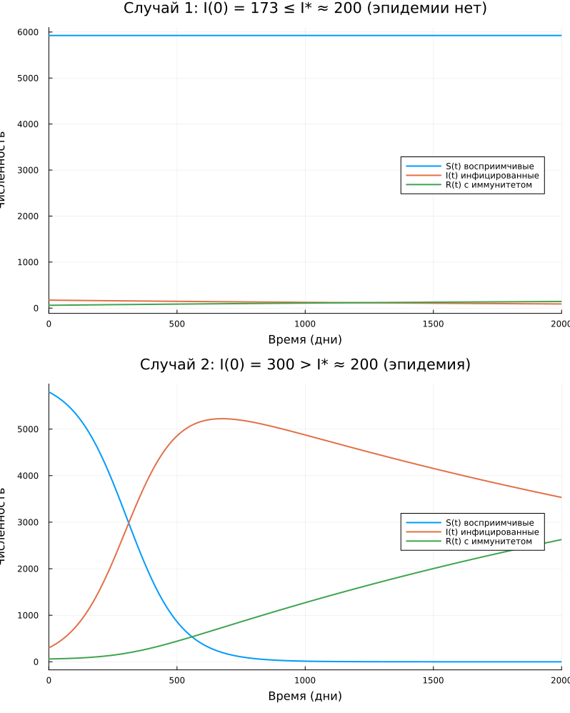

---
## Author
author:
  name: Дагделен Зейнап Реджеповна
  degrees: DSc
  orcid: 0000-0002-0877-7063
  email: 1132236052@rudn.ru
  affiliation:
    - name: Российский университет дружбы народов
      country: Российская Федерация
      postal-code: 117198
      city: Москва
      address: ул. Орджоникизде, д. 3
## Title
title: лабораторная работа 6
subtitle: Моделирование эпидемического процесса (модель SIR)
license: CC BY
date: today
date-format: "YYYY-MM-DD" # Example: 2025-09-06
---

# Информация

## Докладчик

:::::::::::::: {.columns align=center}
::: {.column width="70%"}

  * Дагделен Зейнап Реджеповна
  * студентка НКНбд-01-23
  * факультет физико-математических и естественных наук
  * Российский университет дружбы народов им. П. Лумумбы
  * [1132236052@rudn.ru](mailto:1132236052@pfur.ru)
  * <https://zrdagdelen.github.io>

:::
::: {.column width="30%"}

:::
::::::::::::::

# Вводная часть

## Цель работы

Исследовать математическую модель распространения эпидемии (модель SIR) и проанализировать динамику изменения численности трёх групп популяции в зависимости от начального числа инфицированных.

## Задание

- Реализовать численное решение модели SIR в среде Julia
- Построить графики для двух сценариев: \( I(0) \leq I^* \) и \( I(0) > I^* \)
- Сравнить полученные результаты и сделать выводы

# Выполнение лабораторной работы

## Модель SIR

**Модель SIR** описывает распространение инфекции в изолированной популяции.

**Три группы особей:**

| Обозначение | Расшифровка |
|-------------|-------------|
| $S(t)$ | Восприимчивые (здоровые, но могут заболеть) |
| $I(t)$ | Инфицированные (распространители инфекции) |
| $R(t)$ | Выздоровевшие с иммунитетом |

**Баланс:** $S(t) + I(t) + R(t) = N = \text{const}$

## Cистема уравнений

$$
\begin{cases}
\displaystyle \frac{dS}{dt} = -\frac{\alpha}{N} S I, \\[8pt]
\displaystyle \frac{dI}{dt} = \frac{\alpha}{N} S I - \beta I, \\[8pt]
\displaystyle \frac{dR}{dt} = \beta I.
\end{cases}
$$

## Порог эпидемии:

**Порог эпидемии:**

$$
I^* = \frac{\beta N}{\alpha}
$$

- Если $I(0) \leq I^*$ — больные изолированы, эпидемии **НЕТ**
- Если $I(0) > I^*$ — инфекция распространяется, эпидемия **РАЗВИВАЕТСЯ**

## Интерпретация параметров

| Параметр | Смысл | Значение |
|----------|-------|----------|
| $\alpha$ | Коэффициент заболеваемости (скорость заражения) | 0.01 |
| $\beta$ | Коэффициент выздоровления | 0.000325 |
| $1/\beta$ | Средняя длительность болезни ≈ 3076 дней | ~8.4 года |
| $I^*$ | Критический порог | ≈ 200 человек |

**Важно:** при $I(0) = 173 < I^*$ согласно модели эпидемия не начнётся.

## Результаты моделирования

{#fig-001 width=40%}

## Вывод

В ходе лабораторной работы реализована и исследована модель SIR распространения эпидемии в среде Julia.
