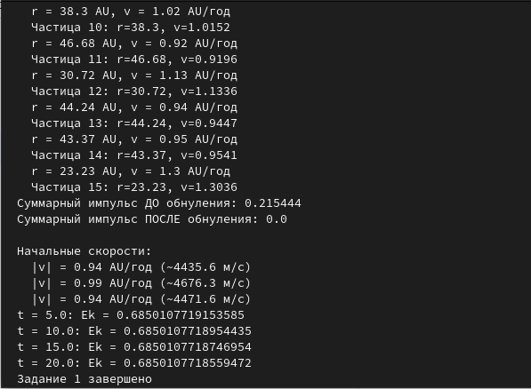
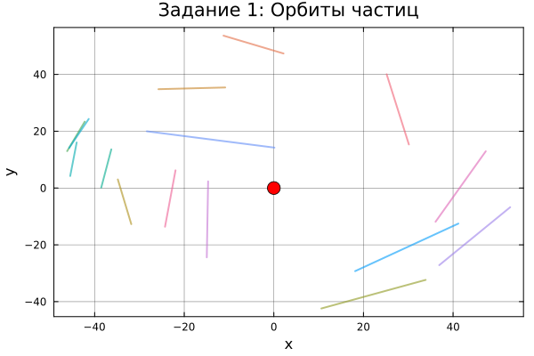
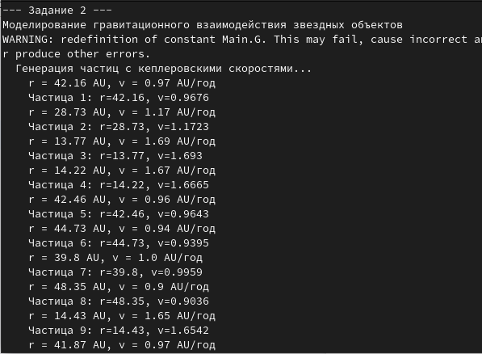
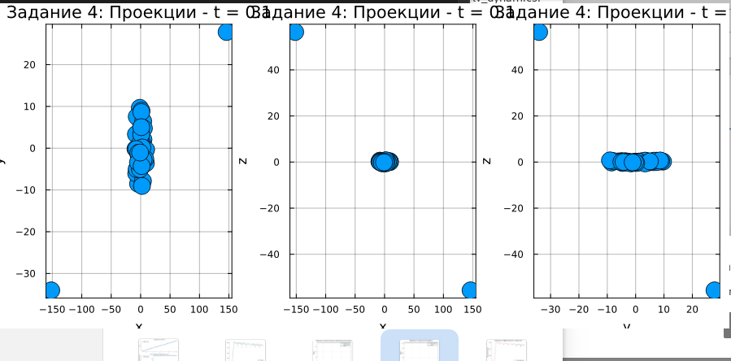
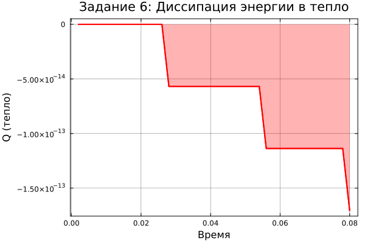
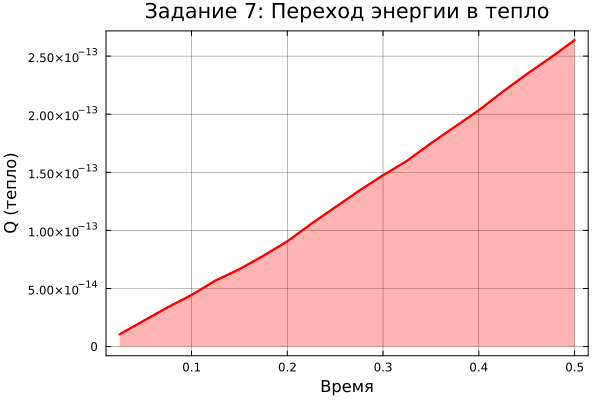

---
## Author
author:
  name: Арбатова Варвара Петровна, Карпова Есения Алексеевна, Дагделен Зейнап Реджеповна, Бюгданюк Анна Васильевна, Люпп Софья Романовна
  degrees: DSc
  orcid: 0000-0002-0877-7063
  affiliation:
    - name: Российский университет дружбы народов
      country: Российская Федерация
      postal-code: 117198
      city: Москва
      address: ул. Орджоникидзе 3
## Title
title: "Образование Солнечной системы"
subtitle: "Теоретические основы"
license: CC BY
date: today
date-format: "YYYY-MM-DD"
---

# Введение

## Цель работы

Цель данной работы — численное моделирование образования планетной системы из газопылевого облака с использованием методов молекулярной динамики, гравитационного взаимодействия, сил трения и слипания частиц.


## Задачи

1. Движение N точек вокруг центральной звезды
2. Гравитация + отталкивание + трение
3. Угловые скорости вращения
4. Переход в 3D
5. Слипание частиц
6. Силы трения
7. Частицы двух сортов (разные массы)

# Программная реализация 

## Структура программы

| Файл | Функция |
|------|---------|
| `particle.jl` | Структура частицы, операции |
| `forces.jl` | Силы (гравитация, трение, отталкивание) |
| `integrator.jl` | Метод Верле |
| `simulation.jl` | Генерация начальных условий |
| `visualization.jl` | Визуализация |
| `tasks.jl` | Выполнение заданий 1-7 |
| `main.jl` | Главный файл, подключение модулей |
| `quickrun.jl` | Быстрый запуск всех заданий |

## Структура частицы

```julia
struct Particle
    m::Float64      # масса
    R::Float64      # радиус
    r::Vector       # координаты
    v::Vector       # скорость
    ω::Float64      # угловая скорость
    active::Bool    # активна
end
```


## Силы взаимодействия

{width=60%}

## Силы взаимодействия

**Гравитация (всегда):**
$$\mathbf{F}^g = -\frac{\gamma m_i m_j}{b^3}\mathbf{b}$$

**Отталкивание (при контакте):**
$$\mathbf{F}^r = k\left(\left(\frac{R_i+R_j}{b}\right)^8-1\right)\frac{\mathbf{b}}{b}$$

## Метод Верле

{width=60%}

## Метод Верле

**Координаты:**
$$\mathbf{r} \leftarrow \mathbf{r} + \mathbf{v}\Delta t + \frac{\mathbf{F}}{2m}\Delta t^2$$

**Скорости:**
$$\mathbf{v} \leftarrow \mathbf{v} + \frac{\mathbf{F}^{old} + \mathbf{F}^{new}}{2m}\Delta t$$

> 2-й порядок точности, хорошо сохраняет энергию


## Генерация начальных условий

{width=60%}


## Задание 1: Движение вокруг центра

{width=60%}

## Задание 1: Орбиты частиц

{width=60%}

## Задание 2: Гравитация между частицами

{width=60%}


## Задание 3: Вращение частиц

{width=60%}


## Задание 4-5: 3D-моделирование и слипание частиц

{width=60%}


## Задание 6: Силы трения

{width=60%}

## Задание 7: Частицы двух сортов

{width=60%}

## Задание 7: График перехода энергии в тепло

{width=60%}

## Визуализация

{width=60%}


## Энергии системы

$$E_k = \sum \frac{m_i v_i^2}{2} + \sum \frac{I_i \omega_i^2}{2}$$

$$U = -\frac{1}{2}\sum_{i \neq j} \frac{\gamma m_i m_j}{b_{ij}}$$

$$E = E_k + U, \quad Q(t) = E(0) - E(t)$$


## Выводы

**Реализовано:**

- 7 скриптов (particle, forces, integrator, simulation, visualization, main, quickrun)
- Метод Верле (2-й порядок точности)
- Гравитация + отталкивание + трение
- Вращение частиц
- 3D + слипание
- Частицы разной массы

