---
author:
  - name: Арбатова Варвара Петровна
    degrees: Bachelor's
    orcid: 0000-0002-0877-7063
    email: 1132236020@rudn.ru
    affiliation:
      name: Российский университет дружбы народов
      country: Российская Федерация
      postal-code: 117198
      city: Москва
      address: ул. Оржоникидзе, 3
  - name: Карпова Есения Алексеевна
    degrees: Bachelor's
    email: 1132236008@rudn.ru
    affiliation:
      name: Российский университет дружбы народов
      country: Российская Федерация
      postal-code: 117198
      city: Москва
      address: ул. Оржоникидзе, 3
  - name: Дагделен Зейнап Реджеповна
    degrees: Bachelor's
    email: 1132236052@rudn.ru
    affiliation:
      name: Российский университет дружбы народов
      country: Российская Федерация
      postal-code: 117198
      city: Москва
      address: ул. Оржоникидзе, 3
  - name: Бюгданюк Анна Васильевна
    degrees: Bachelor's
    email: 1132236023@rudn.ru
    affiliation:
      name: Российский университет дружбы народов
      country: Российская Федерация
      postal-code: 117198
      city: Москва
      address: ул. Оржоникидзе, 3
  - name: Люпп Софья Романовна
    degrees: Bachelor's
    email: 1132236039@rudn.ru
    affiliation:
      name: Российский университет дружбы народов
      country: Российская Федерация
      postal-code: 117198
      city: Москва
      address: ул. Оржоникидзе, 3
title: "Проектная работа. Образование планетной системы"
subtitle: "Первый этап"
license: "CC BY"
---

# Цель работы

Цель данной работы — численное моделирование образования планетной системы из газопылевого облака с использованием методов молекулярной динамики, гравитационного взаимодействия, сил трения и слипания частиц.

# Задание

1. Напиcать программу, моделирующую движение N точек в плоскости, испытывающих притяжение к центральной неподвижной точке, не взаимодействующих между собой  и двигающихся по орбитам с первой космической скоростью.

2. Ввести гравитационное взаимодействие между частицами. Убрать неподвижную центральную точку. Добавить отталкивание между частицами при их сближении на расстояние меньше суммы их радиусов. Вывести на экран кинетическую и потенциальную энергии. Сделать импульс системы равным 0. Добавить силы трения между частицами.

3. Включить в модель угловые скорости вращения вокруг собственной оси каждой частицы.

4. Смоделировать трехмерный случай N взаимодействующих частиц с отталкиванием без трения. Вывести на экран проекции движения частиц в плоскостях XY , Y Z, XZ. Нарисовать зависимость кинетической, потенциальной и полной энергии от времени.

5. Ввести в трехмерном случае слипание частиц после того, как они приблизятся на малое расстояние. При образовании большей частицы должны сохраняться суммарные масса и импульс системы.

6. Ввести силы трения. Объяснить вид кинетической и потенциальной энергии.

7. Ввести частицы двух сортов с разной массой и соответствующим массе радиусом. Добавить силу трения между частицами. Вывести на экран график энергии, переходящей в тепло. Объяснить график полной энергии. Ввести частицы с массами, задаваемыми случайным образом, и соответствующими радиусами.

# Теоретическое введение

### Происхождение звёзд и звёздных систем

Согласно теории Фридмана, Леметра, Гамова возникновение Вселенной произошло из точки в результате Большого взрыва примерно 13,7 млрд. лет назад ([рис. @fig-001]).

{#fig-001 width=70%}

В этот момент времени, который берется за начало отсчета, Вселенная имела очень малый размер и экстремально высокие плотность и температуру. С тех пор Вселенная непрерывно расширяется и остывает.  В процессе расширения и охлаждения образовались элементарные частицы, затем атомы, и под действием гравитационной неустойчивости начали формироваться первые структуры: протоскопления, протогалактики, галактики и, наконец, звёзды.

Звёзды, превышающие массу Солнца в десятки раз, быстро эволюционируют и взрываются как сверхновые, выбрасывая тяжёлые элементы, из которых впоследствии формируются новые звёзды и планеты .

### Образование Солнечной системы

Согласно теории образования Солнечной системы, предложенной Отто Шмидтом (СССР, 1944 год), газопылевое облако, из которого позднее образовались планеты и Солнце нашей Солнечной системы вращалось, и по мере гравитационного сжатия газопылевого облака расстояние всех его частей от оси вращения сокращалось и скорость вращения сгущающегося облака увеличивалась. В плоскости, перпендикулярной оси вращения, сжатие происходило медленнее, и потому облако, бывшее изначально шаровидным, становилось все более плоским. Из-за гравитационной неустойчивости на периферии формирующегося диска отделилось кольцо вещества. Оставшееся облако продолжало сжиматься и вращаться еще быстрее. Затем от него отделилось новое кольцо вещества, и кольца вещества сгустились в планеты ([рис. @fig-002]).

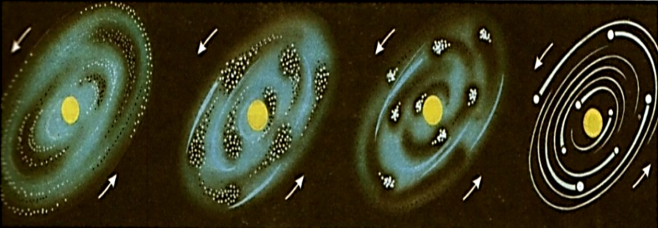{#fig-002 width=70%} 

# Выполнение лабораторной работы

Следующим этапом нашей работы было создание скриптов для выполнения заданий 1-7 для математического моделирования Планетной системы. Первостепенно напишем некоторые вспомогательные скрипты для выполнения заданий. 

В скрипт particle.jl определим структуры частицы и операций с ней: запишем константы, функцию слияния двух частиц с сохранением массы и импульса, вычисление кинетической (поступательной и вращательной) энергии, вычисление и обнуление суммарного импульса системы и получение списка активных частиц 

В скрипте forces.jl вычислим все силы взаимодействия: силы гравитационного притяжения и потенциальной энергии, силы отталкивания при контакте частиц, силы трения и момента силы при контакте частиц, центральную силу притяжения к неподвижной точке для задания №1, а затем выполним подсчет всех сил 

{#fig-004 width=70%}

В скрипт integrator.jl запишем метод Верле для интегрирования уравнений движения. Реализуем шаг метода Верле по скорости и выполним серии шагов интегрирования 

{#fig-005 width=70%}

Скрипт simulation.jl предоставляет функции для генерации начальных условий для частиц с различными свойствами (массы, радиусы, скорости) и распределениями (2D или 3D диски). Генерируем начальное положение и скорости для одной частицы на круговой орбите вокруг центрального тела, затем генерируем N частиц, равномерно распределенных в 2D диске с кеплеровскими скоростями и N частиц в 3D диске. После реализуем функцию генерации частиц двух сортов (легкие и тяжелые) с разными массами ([рис. @fig-006]).

{#fig-006 width=70%}

Далее реализуем скрипт visualization.jl, где визуализируем все полученные результаты, а именно: отображение положений частиц в 2D, отображение проекций 3D системы на плоскости XY, XZ, YZ, положение графиков энергий и графика изменения числа частиц, построение траекторий частиц (для задания 1). После визуализируем частицы с разным цветом для разных масс и выведем информацию об энергиях в консоль ([рис. @fig-007]).

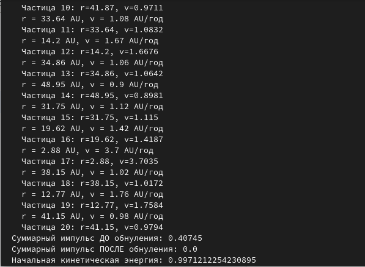{#fig-007 width=70%}

Запишем главный файл программы main.jl, куда подключим все модули скриптов, написанных ранее, чтобы запустить все задания 1-7 по порядку, а также файл quickrun.jl для быстрого запуска всех заданий ([рис. @fig-008]).

Задание 1. Выполняем моделирование движения частиц в центральном поле звезды ([рис. @fig-003]) ([рис. @fig-004]) ([рис. @fig-005]).

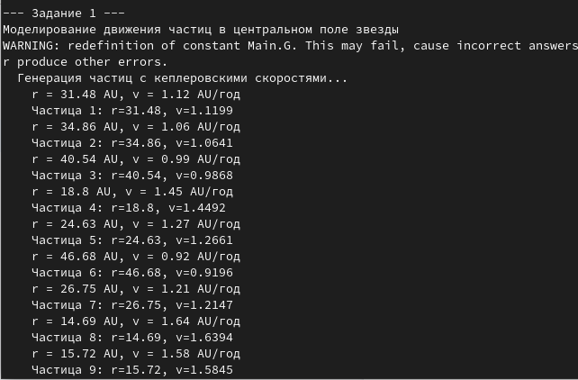{#fig-003 width=70%}

{#fig-004 width=70%}

{#fig-005 width=70%}

Задание 2. Моделируем гравитационное взаимодействие всех звездных обьектов ([рис. @fig-006]) ([рис. @fig-007]) ([рис. @fig-008]) ([рис. @fig-009]).

{#fig-006 width=70%}

{#fig-007 width=70%}

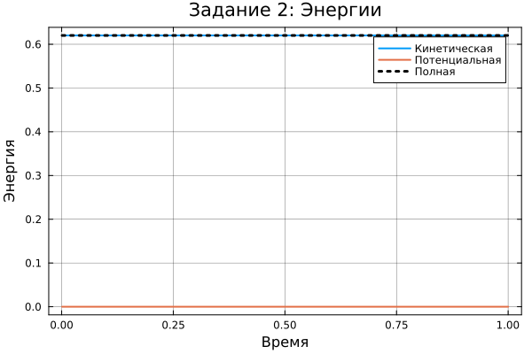{#fig-008 width=70%}

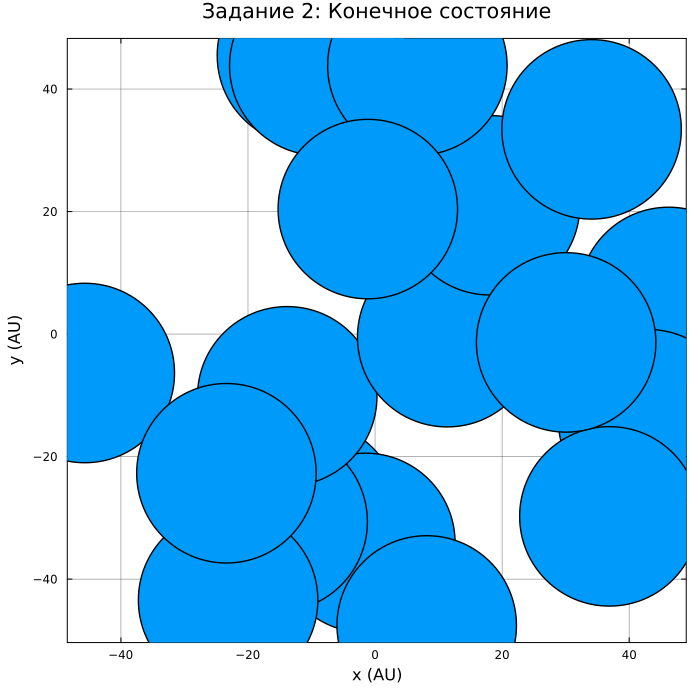{#fig-009 width=70%}

Задание 3. Реализуем моделирование с учетом вращения частиц ([рис. @fig-006]) ([рис. @fig-007]) ([рис. @fig-008]).

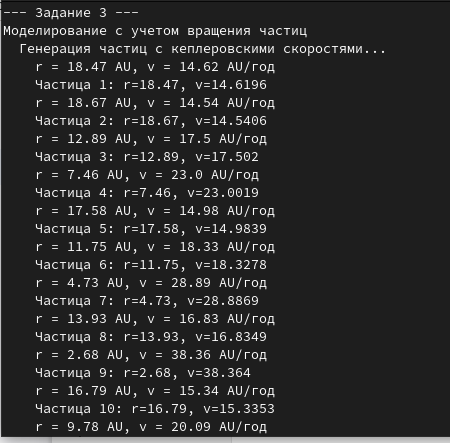{#fig-010 width=70%}

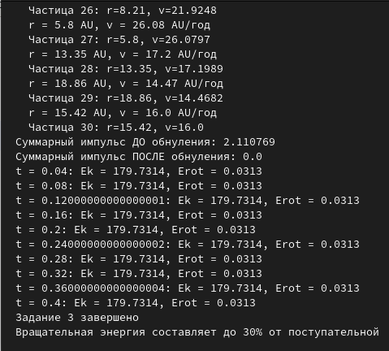{#fig-011 width=70%}

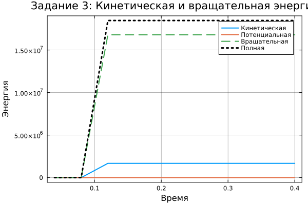{#fig-012 width=70%}

Задание 4. Сделаем 3D модель без учета силы трения ([рис. @fig-013]) ([рис. @fig-014]) ([рис. @fig-015]) ([рис. @fig-016]).

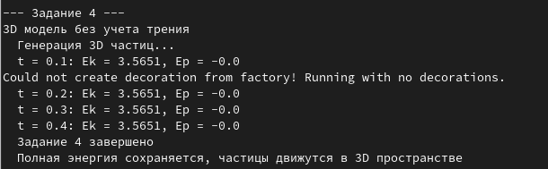{#fig-013 width=70%}

{#fig-014 width=70%}

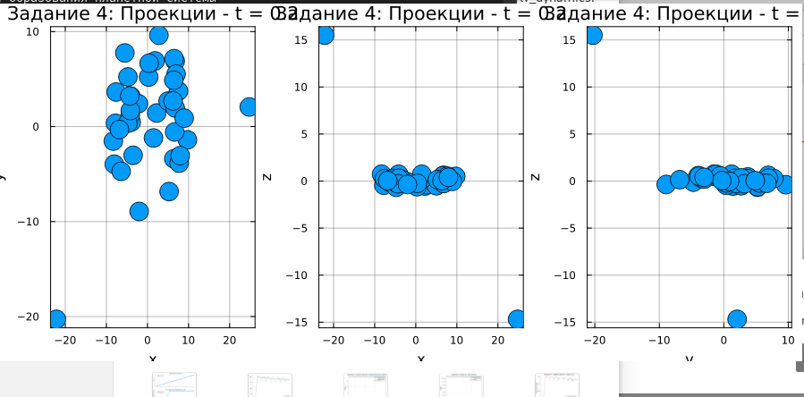{#fig-015 width=70%}

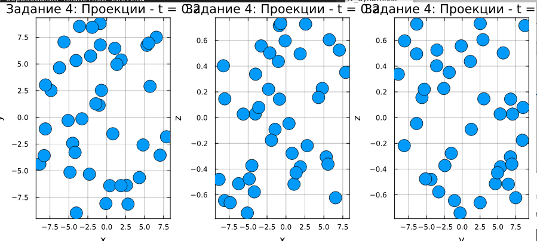{#fig-016 width=70%}

Задание 5. Введем в трехмерном случае слипание частиц после того, как они приблизятся на малое расстояние ([рис. @fig-017]) ([рис. @fig-018]) ([рис. @fig-019]) ([рис. @fig-020]).

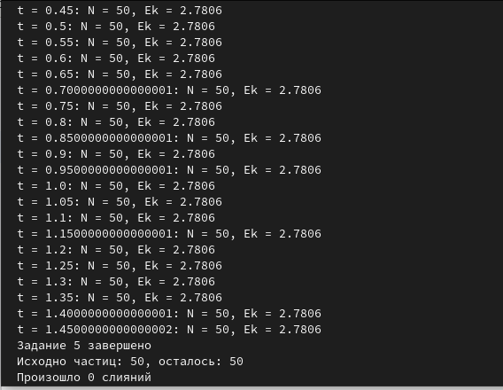{#fig-017 width=70%}

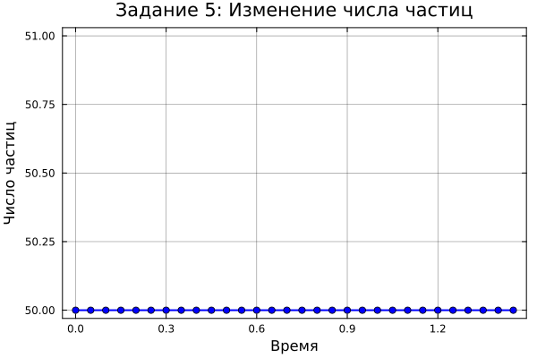{#fig-018 width=70%}

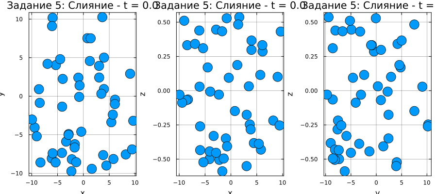{#fig-019 width=70%}

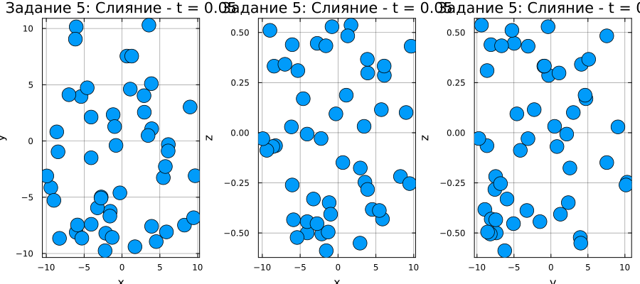{#fig-020 width=70%}

Задание 6. Введем силу трения ([рис. @fig-021]) ([рис. @fig-022]) ([рис. @fig-023]) ([рис. @fig-024]) ([рис. @fig-025]) ([рис. @fig-026]).

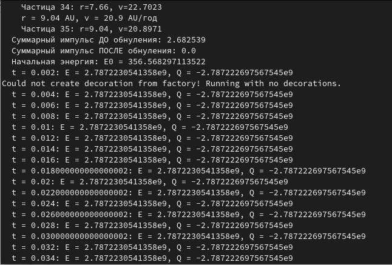{#fig-021 width=70%}

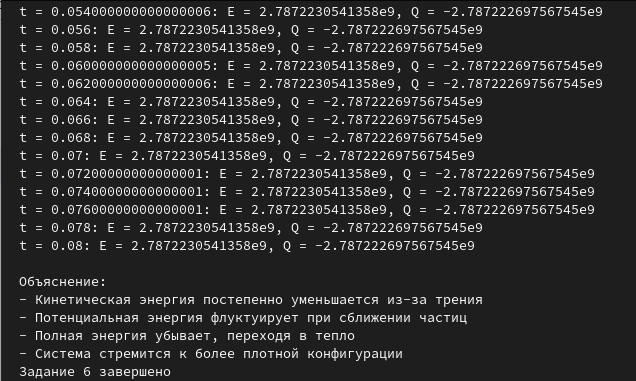{#fig-022 width=70%}

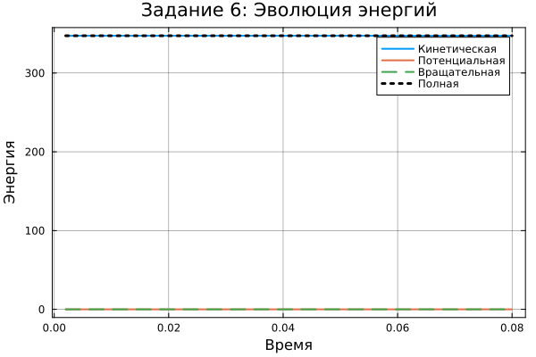{#fig-023 width=70%}

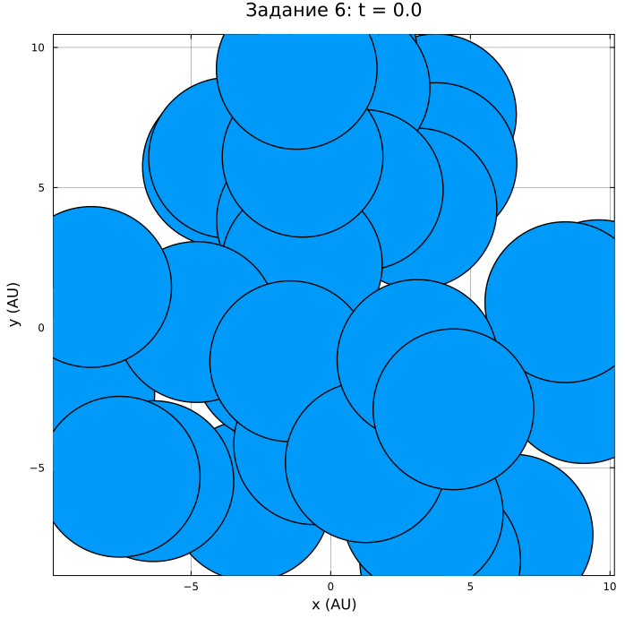{#fig-024 width=70%}

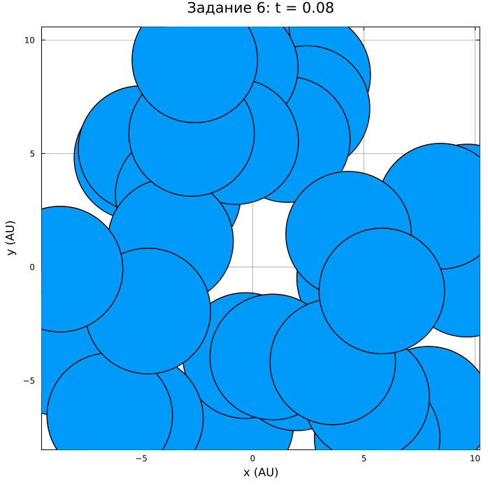{#fig-025 width=70%}

{#fig-026 width=70%}

Задание 7. Моделируем частицы двух сортов с разными массами ([рис. @fig-027]) ([рис. @fig-028]) ([рис. @fig-029]) ([рис. @fig-030]) ([рис. @fig-031]) ([рис. @fig-032]).

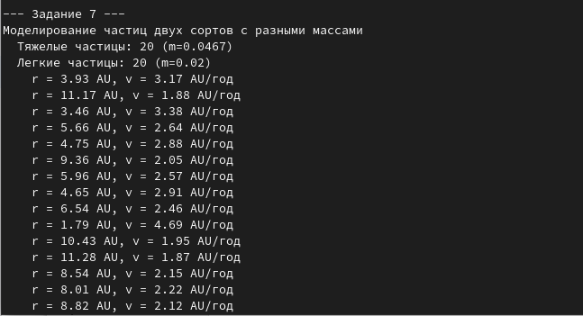{#fig-027 width=70%}

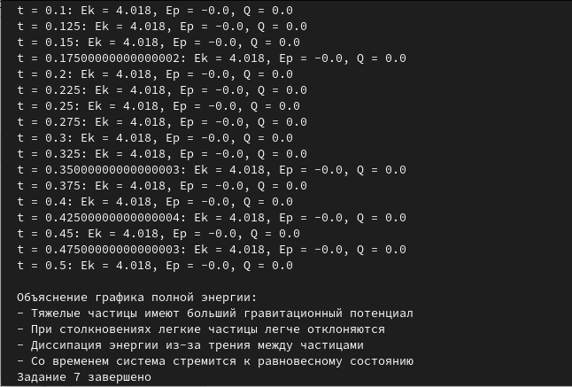{#fig-028 width=70%}

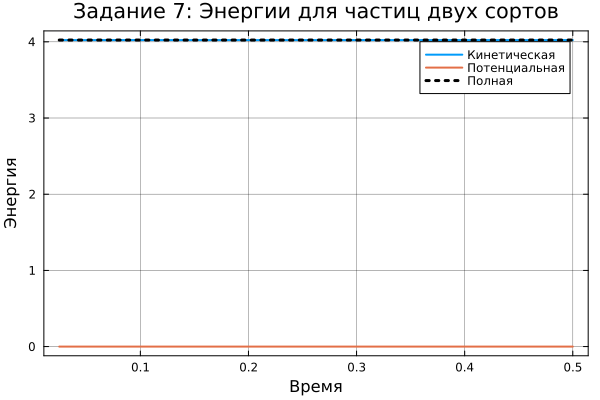{#fig-029 width=70%}

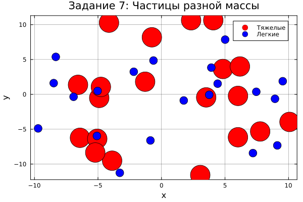{#fig-030 width=70%}

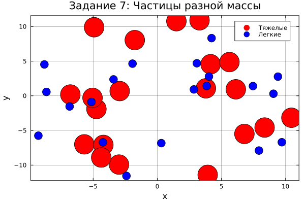{#fig-031 width=70%}

{#fig-032 width=70%}

# Выводы

Нами были реализованы скрипты для визуализации численного моделирования образования планетной системы из газопылевого облака с использованием методов молекулярной динамики, гравитационного взаимодействия, сил трения и слипания частиц.

# Список литературы{.unnumbered}

- [Медведев Д. А. - Моделирование физических процессов и явлений.](https://esystem.rudn.ru/pluginfile.php/3094549/mod_folder/content/0/%D0%9C%D0%B5%D0%B4%D0%B2%D0%B5%D0%B4%D0%B5%D0%B2%20%D0%94.%20%D0%90.%20-%20%D0%9C%D0%BE%D0%B4%D0%B5%D0%BB%D0%B8%D1%80%D0%BE%D0%B2%D0%B0%D0%BD%D0%B8%D0%B5%20%D1%84%D0%B8%D0%B7%D0%B8%D1%87%D0%B5%D1%81%D0%BA%D0%B8%D1%85%20%D0%BF%D1%80%D0%BE%D1%86%D0%B5%D1%81%D1%81%D0%BE%D0%B2%20%D0%B8%20%D1%8F%D0%B2%D0%BB%D0%B5%D0%BD%D0%B8%D0%B9%20%D0%BD%D0%B0%20%D0%9F%D0%9A.pdf?forcedownload=1)

- [Большой взрыв](https://pikabu.ru/story/paru_slov_o_bolshom_vzryive_7673576?cid=178197280)

- [Происхождение Солнечной системы](http://chudinov.ru/butusov/5/)

::: {#refs}
:::
